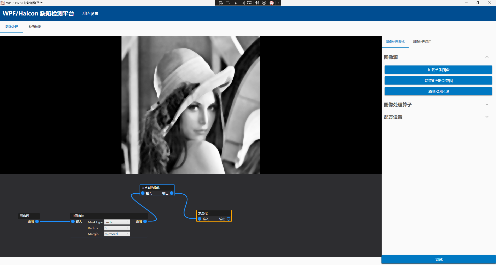
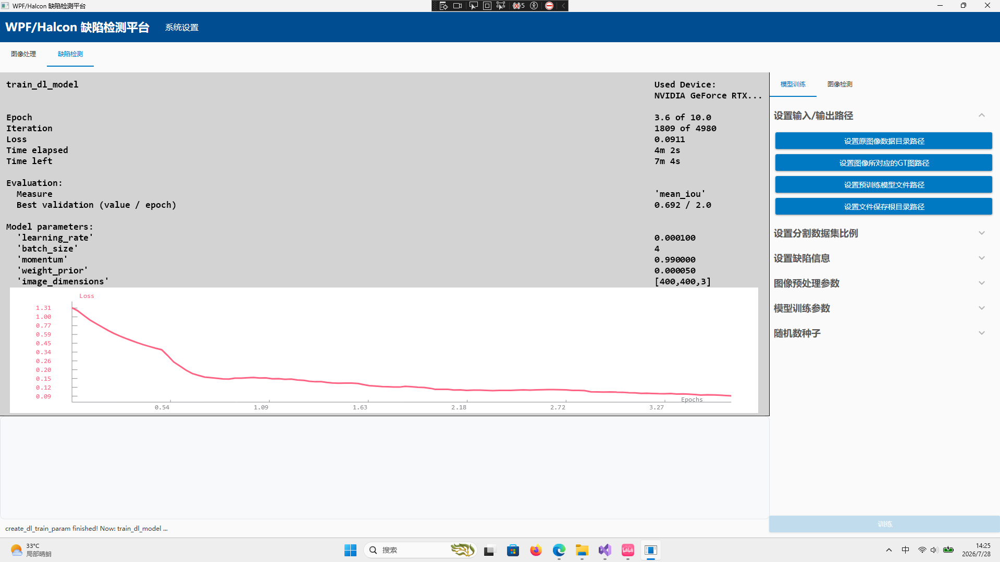
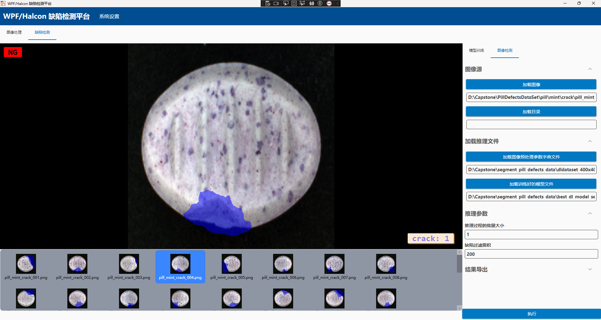

# 基于C#和HALCON深度学习算子的缺陷检测（语义分割）系统

## 运行平台

Windows操作系统，需安装有.NET 8环境和HALCON相关动态链接库。

## 项目简介

本系统是基于**C#**和**HALCON**深度学习算子的缺陷检测系统，前端界面使用**WPF**搭建，界面语言允许**中英文切换**，系统设置的保存采用了**SQLite**数据库；项目功能可分为**图像处理**、**模型训练**和**缺陷检测**三大模块。图像处理模块为用户提供**可视化节点编辑器**（基于Nodify开发），可以方便地调整图像处理步骤和参数，允许图像批处理，同时还可**保存配方**和**导入配方**；模型训练模块通过读取用户指定的数据集及其标注图以及设置的图像预处理参数和模型参数，在HALCON提供的预训练模型`pretrained_dl_segmentation_enhanced.hdl`的基础上进行迁移学习，最终可导出训练生成的模型文件；缺陷检测模块基于训练而得的模型文件，对于输入图像进行缺陷检测，可以调整缺陷过滤面积，可以检测出图像中的物品是否有缺陷、缺陷的类型以及对应缺陷的个数和总面积，检测结果展示友好，允许图像批检测，允许导出检测结果。本项目架构清晰，易于维护；模型训练和缺陷检测模块的实现参考了HALCON中`segment_pill_defects_deep_learning`语义分割示例程序的实现思路。

## 技术讲解

### 项目整体

项目整体使用了**Prism**框架以实现**MVVM**设计模式和页面导航，使用了Prism.DryIoc**依赖注入**容器。

### 前端界面

前端界面使用了**MaterialDesign**以美化界面和控件以及设置界面主题色和深浅色模式。

### 核心功能

图像处理、模型训练和缺陷检测的核心功能实现依赖于HALCON的相关**算子**：

- Rgb1ToGray（用于图像灰度化）
- EquHistoImage（直方图均衡化）
- MedianImage（中值滤波）
- GaussFilter（高斯滤波）
- ReadDlModel（读取HALCON深度学习模型）
- SetDlModelParam（设置HALCON深度学习模型参数）
- TrainDlModelBatch（训练HALCON深度学习模型）
- ApplyDlModel（对图像集应用HALCON深度学习模型以进行推理）
- Threshold（阈值分割）
- AreaCenter（计算区域的面积以及区域中心行列坐标）
- ......

## 项目展示

### 图像处理

### 模型训练

### 缺陷检测

